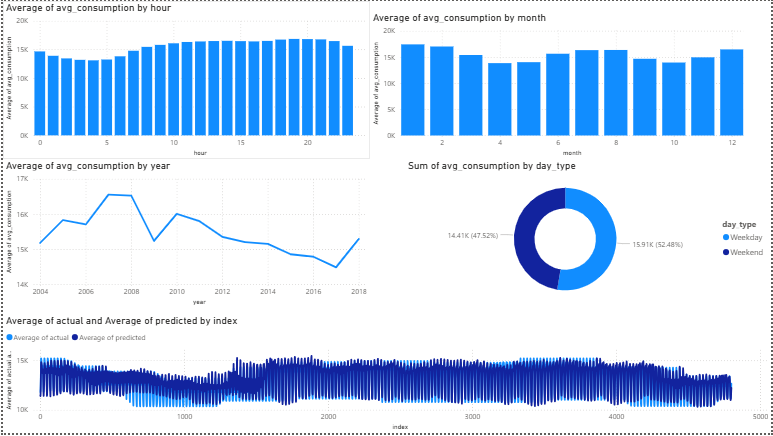

# ⚡ Energy Consumption Forecasting

A end-to-end data analytics and deep learning project to forecast hourly energy consumption using LSTM neural networks.

## Tech Stack.
- Python, Pandas, NumPy
- PyTorch (LSTM + Transformer)
- Scikit-learn
- SQL (SQLite)
- Power BI

## Results
- Model: LSTM Neural Network
- MAPE: 3.80% (industry standard is under 5%)
- Data: 14 years of hourly energy data (2004-2018)

## Project Structure
- notebooks/ - Jupyter notebooks for EDA and modeling
- src/ - Python source files
- sql/ - SQL analysis queries
- powerbi/ - Dashboard export data

## Dataset
Hourly Energy Consumption by Rob Mulla (Kaggle)

## Dashboard

